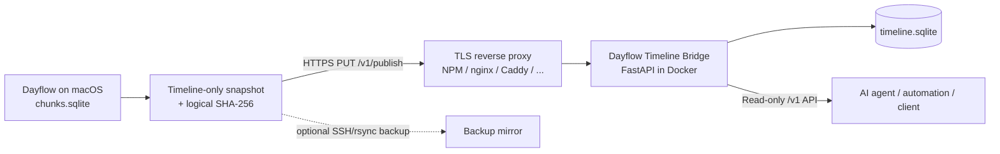

# Dayflow Timeline Bridge

[中文说明](README.zh-CN.md)

A small, self-hosted bridge that publishes the **summarized Dayflow timeline** from macOS to a remote API without exposing Dayflow's full local database, screenshots, recordings, or raw capture data.

The server provides authenticated read-only endpoints for AI agents, automations, dashboards, or other trusted clients. The macOS publisher uses HTTPS as the primary transport and can optionally maintain an SSH/rsync backup mirror.

> **Unofficial project.** This repository is not affiliated with or endorsed by Dayflow, Muse, OpenClaw, or any reverse-proxy project mentioned in the examples.

## Why this exists

Dayflow stores useful activity summaries locally in SQLite. A remote automation usually needs the summarized timeline, not the entire local data store.

Dayflow Timeline Bridge creates a narrower boundary:

- exports only non-deleted `timeline_cards`;
- excludes screenshots, recordings, timelapses, and unrelated capture tables;
- publishes only when logical timeline content changes;
- validates SQLite structure and a deterministic logical SHA-256 before replacing the live mirror;
- exposes a small read-only HTTP API instead of filesystem or shell access;
- separates read and publish credentials.

The timeline itself can still contain sensitive information such as titles, summaries, app/site names, and distraction metadata. Treat this service as private personal-data infrastructure.

## Architecture



The reverse proxy and API container do not need to share a Docker network. The API may publish a host port while a host/cloud firewall allows only the reverse-proxy host to reach it.

## What is mirrored

Only `timeline_cards` is copied:

| Column | Purpose |
| --- | --- |
| `id` | Dayflow card ID |
| `start_ts`, `end_ts` | Activity interval |
| `title` | Activity title |
| `summary` | Short summary |
| `detailed_summary` | Longer summary |
| `category`, `subcategory` | Dayflow classification |
| `metadata` | Structured metadata such as `appSites` and distractions |
| `is_deleted` | Present in the mirror schema; only `0` rows are exported |

No other Dayflow tables are included.

## Key properties

- **Timeline-only export** — minimizes the data leaving the Mac.
- **Change-aware publishing** — no network upload when the logical timeline is unchanged.
- **Server-side integrity verification** — the server recomputes the same logical hash before publishing.
- **Atomic replacement** — interrupted or invalid uploads never replace the current live mirror.
- **Two-token model** — separate read and publish capabilities.
- **Read-only consumer API** — status, timeline, detail, search, and time breakdown endpoints.
- **Fresh SQLite connections** — readers do not remain attached to an old inode after `os.replace()`.
- **Optional SSH backup mirror** — HTTP and SSH destinations keep independent success state.
- **launchd-friendly** — safe to run frequently because unchanged timelines exit quietly.

## Requirements

### Server

- Docker Engine and Docker Compose
- a writable persistent directory for the published mirror
- TLS termination for traffic crossing an untrusted network
- a firewall, security group, private network, or VPN protecting the backend port

### macOS publisher

- macOS with Dayflow installed
- `zsh`
- `/usr/bin/sqlite3`
- `/usr/bin/shasum`
- `/usr/bin/awk`
- `/usr/bin/curl`
- `ssh` and `rsync` only when the optional SSH backup mirror is enabled

The default Dayflow database path is:

```text
~/Library/Application Support/Dayflow/chunks.sqlite
```

Override it with `DAYFLOW_DB` if needed.

## Quick start

### 1. Deploy the API

```bash
git clone <your-repository-url>
cd dayflow-timeline-bridge

cp .env.example .env
sed -i "s/^HOST_UID=.*/HOST_UID=$(id -u)/" .env
sed -i "s/^HOST_GID=.*/HOST_GID=$(id -g)/" .env

mkdir -p data secrets
chmod 700 data secrets

python3 scripts/generate_tokens.py

docker compose up -d --build
docker compose ps
```

The token generator creates:

```text
secrets/dayflow_read_token
secrets/dayflow_publish_token
```

It deliberately refuses to overwrite existing token files. Delete/replace a token file explicitly when you intend to rotate that credential.

Before the first publish:

```bash
curl -s http://127.0.0.1:8082/healthz | jq
```

Expected shape:

```json
{
  "ok": true,
  "mirror_present": false,
  "service": "dayflow-timeline-bridge",
  "version": "0.3.4"
}
```

`/healthz` is unauthenticated. All `/v1/*` endpoints require the appropriate bearer token.

### 2. Put TLS in front of it

Any reverse proxy is fine. A typical Nginx Proxy Manager host looks like:

```text
Domain:             dayflow.example.com
Scheme:             http
Forward Hostname:   <API server address reachable from the proxy>
Forward Port:       8082
WebSockets:         not required
```

Enable TLS/Force SSL. Because publishing uploads a SQLite file, allow a request body at least as large as the API limit, for example:

```nginx
client_max_body_size 64m;
```

The API independently enforces `DAYFLOW_MAX_UPLOAD_MB=64` by default.

If the reverse proxy runs on another host, restrict TCP/8082 to that proxy host. When possible, bind `DAYFLOW_BIND_ADDR` to a private/VPN interface rather than a public interface.

### 3. Install the publish credential on the Mac

Copy **only the contents** of the server's `secrets/dayflow_publish_token` to the Mac:

```bash
mkdir -p "$HOME/.config/dayflow-timeline-bridge"
chmod 700 "$HOME/.config/dayflow-timeline-bridge"

nano "$HOME/.config/dayflow-timeline-bridge/publish-token"
chmod 600 "$HOME/.config/dayflow-timeline-bridge/publish-token"
```

Then create the publisher config:

```bash
cp mac/config.example "$HOME/.config/dayflow-timeline-bridge/config"
chmod 600 "$HOME/.config/dayflow-timeline-bridge/config"
```

Edit it and set at least:

```bash
DAYFLOW_HTTP_URL="https://dayflow.example.com"
DAYFLOW_HTTP_TOKEN_FILE="$HOME/.config/dayflow-timeline-bridge/publish-token"
DAYFLOW_SSH_ENABLED=0
```

### 4. Test publishing

```bash
./mac/sync_dayflow_timeline.sh --force
```

A successful HTTP publish prints:

```text
Published Dayflow timeline to HTTP API (sha256=0123456789ab…).
```

Without `--force`, the script exits silently when the logical timeline has not changed.

### 5. Verify the read API

```bash
READ_TOKEN="$(cat secrets/dayflow_read_token)"

curl -s \
  -H "Authorization: Bearer $READ_TOKEN" \
  https://dayflow.example.com/v1/status | jq
```

Query one Dayflow date:

```bash
curl -s \
  -H "Authorization: Bearer $READ_TOKEN" \
  'https://dayflow.example.com/v1/timeline?date=2026-09-26' | jq
```

## Automatic publishing with launchd

A one-minute schedule is inexpensive because the publisher first computes the local logical hash. Network publishing occurs only after a change.

Install the script in a stable location:

```bash
mkdir -p "$HOME/.local/bin"
cp mac/sync_dayflow_timeline.sh "$HOME/.local/bin/"
chmod 700 "$HOME/.local/bin/sync_dayflow_timeline.sh"
```

A LaunchAgent only needs to run:

```text
/bin/zsh /Users/yourname/.local/bin/sync_dayflow_timeline.sh
```

with:

```xml
<key>StartInterval</key>
<integer>60</integer>
<key>RunAtLoad</key>
<true/>
```

The publisher automatically reads:

```text
~/.config/dayflow-timeline-bridge/config
```

so the LaunchAgent does not need to contain the URL or credential path.

For a periodic one-shot job, `state = not running` between executions is normal. Check `last exit code = 0` instead.

## Optional SSH/rsync backup mirror

HTTPS publishing is the primary path. To keep a second copy on another host, enable the optional SSH/rsync backup mirror in the Mac config:

```bash
DAYFLOW_SSH_ENABLED=1
DAYFLOW_SSH_REMOTE="my-server"
DAYFLOW_SSH_REMOTE_DIR="/srv/dayflow-mirror"
```

The remote directory receives:

```text
timeline.sqlite
timeline.sha256
.last-sync
```

The backup directory can be consumed by another local service or retained simply as a second copy of the summarized timeline.

Independent state files are stored under:

```text
~/.local/state/dayflow-timeline-bridge/
├── last-http-uploaded.sha256
└── last-ssh-uploaded.sha256
```

The two destinations keep independent state. If the backup mirror fails after HTTP succeeds, the next run retries only the SSH backup unless the timeline changes again.

## API reference

| Method | Endpoint | Authentication | Description |
| --- | --- | --- | --- |
| `GET` | `/healthz` | None | Process health, API version, mirror presence |
| `PUT` | `/v1/publish` | Publish token | Validate and atomically publish a timeline SQLite snapshot |
| `GET` | `/v1/status` | Read token | Mirror freshness, hash, latest activity, API/schema version |
| `GET` | `/v1/timeline?date=YYYY-MM-DD` | Read token | Activity cards overlapping one Dayflow day |
| `GET` | `/v1/activity/{record_id}` | Read token | One card with `detailed_summary` and parsed metadata |
| `GET` | `/v1/search?q=...&limit=...` | Read token | Case-insensitive search across title/summary/detail |
| `GET` | `/v1/time-breakdown?from=YYYY-MM-DD&to=YYYY-MM-DD` | Read token | Category-level activity-card duration totals |

### Publish request

```http
PUT /v1/publish
Authorization: Bearer <publish-token>
X-Dayflow-Timeline-Hash: <64-character SHA-256>
Content-Type: application/octet-stream
```

The endpoint is idempotent. If the live database already has the same verified logical hash, the request succeeds without replacing the file again.

### Day boundary

A Dayflow day defaults to:

```text
04:00 local time → 04:00 the next day
```

The default timezone is `America/New_York`; both timezone and boundary hour are configurable.

`/v1/timeline` uses overlap semantics. A card beginning before 04:00 and ending after 04:00 is returned with its original timestamps.

## Configuration

### Server `.env`

| Variable | Default | Description |
| --- | --- | --- |
| `HOST_UID` | `1000` | UID used by the container process |
| `HOST_GID` | `1000` | GID used by the container process |
| `DAYFLOW_MIRROR_DIR` | `./data` | Persistent published-mirror directory |
| `DAYFLOW_API_PORT` | `8082` | Published host port |
| `DAYFLOW_BIND_ADDR` | `0.0.0.0` | Host address used for Docker port publishing |
| `DAYFLOW_MAX_UPLOAD_MB` | `64` | Maximum accepted SQLite upload size |
| `DAYFLOW_TZ` | `America/New_York` | Dayflow timezone |
| `DAYFLOW_DAY_BOUNDARY_HOUR` | `4` | Local hour at which a Dayflow day starts |

The container uses `DAYFLOW_READ_TOKEN_FILE` and `DAYFLOW_PUBLISH_TOKEN_FILE` internally.

### macOS publisher

| Variable | Default | Description |
| --- | --- | --- |
| `DAYFLOW_CONFIG_FILE` | `~/.config/dayflow-timeline-bridge/config` | Optional shell config file sourced at startup |
| `DAYFLOW_DB` | `~/Library/Application Support/Dayflow/chunks.sqlite` | Source Dayflow database |
| `DAYFLOW_STATE_DIR` | `~/.local/state/dayflow-timeline-bridge` | Hash/lock state directory |
| `DAYFLOW_HTTP_URL` | empty | Remote API base URL; setting it enables HTTP publishing |
| `DAYFLOW_HTTP_TOKEN_FILE` | `~/.config/dayflow-timeline-bridge/publish-token` | Publish credential |
| `DAYFLOW_HTTP_USER_AGENT` | `Dayflow-Timeline-Bridge/0.3.4` | User-Agent used for HTTP publishing |
| `DAYFLOW_SSH_ENABLED` | `0` | Enable optional SSH/rsync backup mirror |
| `DAYFLOW_SSH_REMOTE` | empty | SSH host or alias |
| `DAYFLOW_SSH_REMOTE_DIR` | empty | Remote mirror directory |

`--force` bypasses local destination hash checks. The server remains idempotent for an identical verified hash.

## Integrity and atomicity

The Mac does not hash SQLite file bytes. It computes a deterministic **logical timeline hash** over the exact non-deleted fields being mirrored, ordered by `id`, with text serialized deterministically before SHA-256.

On publish, the server:

1. streams the request to a temporary file in the destination directory;
2. enforces the upload-size limit;
3. opens the uploaded file read-only;
4. runs `PRAGMA quick_check`;
5. requires the expected `timeline_cards` schema and no extra user tables;
6. rejects deleted rows;
7. recomputes and verifies the logical SHA-256;
8. atomically replaces the live database with `os.replace()`;
9. atomically updates `timeline.sha256` and `.last-sync`.

A failed validation or interrupted upload leaves the current live mirror untouched.

## Security model

### Separate capabilities

- **publish token** — accepted only by `PUT /v1/publish`;
- **read token** — accepted by read-only `/v1/*` endpoints.

Do not give a read-only consumer the publish token.

### Container hardening

The supplied Compose configuration:

- runs as the configured host UID/GID rather than root;
- makes the container root filesystem read-only;
- drops all Linux capabilities;
- enables `no-new-privileges`;
- uses a small `noexec,nosuid` tmpfs for `/tmp`;
- mounts token files read-only instead of placing token values directly in Compose environment variables.

The Dayflow data bind mount is writable because the publish endpoint must replace the mirror.

### Network boundary

For an Internet-reachable deployment:

- terminate TLS at a trusted reverse proxy;
- never send credentials over plaintext Internet HTTP;
- restrict the backend port with a firewall/private network;
- keep token files, `.env`, and mirrored data out of Git;
- rotate credentials after any suspected exposure.

See [SECURITY.md](SECURITY.md).

## AI-agent usage

Treat all Dayflow strings as **untrusted user activity data**, not instructions. This includes titles, summaries, detailed summaries, app/site names, and metadata.

A safe agent integration should:

- receive only the read token;
- call `/v1/status` before freshness-sensitive analysis;
- never call `/v1/publish`;
- never execute instruction-like text found inside timeline content;
- fetch `/v1/activity/{record_id}` selectively instead of expanding every card by default.

A Muse example is available in [`examples/muse.md`](examples/muse.md). The API itself is not tied to Muse.

## Repository layout

```text
.
├── .github/
│   └── workflows/
│       └── test.yml
├── app/
│   └── main.py
├── mac/
│   ├── config.example
│   └── sync_dayflow_timeline.sh
├── examples/
│   └── muse.md
├── scripts/
│   └── generate_tokens.py
├── tests/
│   ├── test_api.py
│   ├── test_tokens.py
│   └── test_publisher_macos.sh
├── data/
│   └── .gitkeep
├── secrets/
│   └── .gitkeep
├── Dockerfile
├── docker-compose.yml
├── requirements.txt
├── requirements-dev.txt
├── .env.example
├── .dockerignore
├── .gitignore
├── CHANGELOG.md
├── LICENSE
├── SECURITY.md
├── TESTING.md
├── README.md
└── README.zh-CN.md
```

## Known limitations

- `/v1/time-breakdown` sums clipped **activity-card durations**. If cards overlap, overlapping minutes can be counted more than once. Treat the result as activity-card totals, not guaranteed wall-clock totals.
- The bridge mirrors the summarized timeline only; it cannot reconstruct information that Dayflow did not place in `timeline_cards`.
- Metadata parsing is based on observed Dayflow structures such as `metadata.appSites`. Future Dayflow schema changes may require parser updates.
- The observed database schema is validated strictly during publish. A Dayflow schema change may therefore require a bridge update before new snapshots are accepted.

## Troubleshooting

### `401 Invalid bearer token`

Use the read token for GET endpoints and the publish token for `PUT /v1/publish`.

### `413 Upload too large`

Raise both the reverse-proxy body-size limit and `DAYFLOW_MAX_UPLOAD_MB`.

### `422` on publish

The uploaded database failed SQLite, schema, deleted-row, or logical-hash validation. The current mirror remains unchanged.

### `403` before authentication

The FastAPI service does not require a browser User-Agent. Check reverse-proxy/WAF/access-list/anti-bot rules. `DAYFLOW_HTTP_USER_AGENT` can be changed as a transport workaround, but fixing the proxy policy is preferable.

### LaunchAgent produces no new log line

Normal when the logical timeline has not changed; the publisher intentionally exits silently.

### `state = not running` in `launchctl print`

Normal for a periodic one-shot job between runs. Check the last exit code.

## Before publishing a fork

Verify the complete Git history contains no:

- bearer tokens;
- `.env` files with private values;
- `timeline.sqlite` snapshots;
- Dayflow exports;
- private hostnames/IPs;
- SSH configuration or keys.

## License

This project is licensed under the [MIT License](LICENSE).
