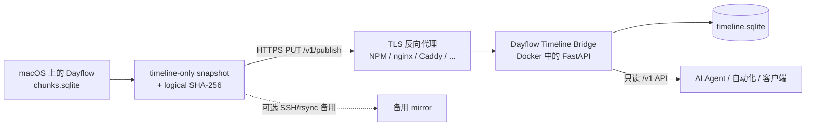

# Dayflow Timeline Bridge

[English README](README.md)

一个小型、自托管的 Bridge，用于把 macOS 上 **Dayflow 已总结的 timeline** 发布到远端 API，同时避免暴露 Dayflow 完整本地数据库、截图、录屏或原始采集数据。

服务端提供带认证的只读 API，可以交给 AI Agent、自动化任务、Dashboard 或其他受信任客户端。macOS publisher 以 HTTPS 作为主传输路径，并可选维护一份 SSH/rsync 备用镜像。

> **非官方项目。** 本仓库与 Dayflow、Muse、OpenClaw，以及文档中提到的反向代理项目均无官方隶属或背书关系。

## 为什么需要它

Dayflow 会把很有价值的活动总结保存在本机 SQLite 中，但远端自动化通常只需要已经总结好的 timeline，并不需要整个本地数据仓库。

Dayflow Timeline Bridge 建立了一个更窄的数据边界：

- 只导出未删除的 `timeline_cards`；
- 不导出截图、录屏、timelapse 和其他 raw capture 表；
- 只有 logical timeline 内容变化时才上传；
- 服务端在发布前校验 SQLite 结构和确定性的 logical SHA-256；
- 消费端使用小型只读 HTTP API，而不是获得文件系统或 shell 权限；
- read 与 publish 使用两个独立 Bearer token。

需要注意：timeline 本身仍可能包含敏感信息，例如标题、总结、应用/网站名称和 distraction metadata，因此这个服务仍应按私人数据基础设施来保护。

## 架构



反向代理与 API 容器不需要位于同一个 Docker network。可以直接把 API 发布到宿主机端口，再通过宿主机/云防火墙只允许反向代理主机访问该端口。

## 会同步哪些内容

只复制 `timeline_cards`：

| 字段 | 用途 |
| --- | --- |
| `id` | Dayflow card ID |
| `start_ts`, `end_ts` | 活动时间区间 |
| `title` | 活动标题 |
| `summary` | 简短总结 |
| `detailed_summary` | 更详细的总结 |
| `category`, `subcategory` | Dayflow 分类 |
| `metadata` | `appSites`、distractions 等结构化信息 |
| `is_deleted` | mirror schema 中保留；只导出值为 `0` 的记录 |

不会复制其他 Dayflow 表。

## 主要特性

- **只同步 timeline**：减少离开 Mac 的数据量。
- **变更感知**：logical timeline 没变化时不产生网络上传。
- **服务端完整性复核**：发布前重新计算相同 logical hash。
- **原子替换**：上传中断或校验失败不会破坏当前可用 mirror。
- **双 token 权限分离**：read 与 publish credential 完全独立。
- **只读消费 API**：提供 status、timeline、detail、search、time breakdown。
- **每请求新建 SQLite 连接**：atomic replace 后不会长期绑定旧 inode。
- **可选 SSH 备用镜像**：HTTP 与 SSH 两边拥有独立成功状态。
- **适合 launchd 高频运行**：timeline 没变化时安静退出。

## 依赖

### 服务端

- Docker Engine + Docker Compose
- 一个可持久化、可写的 mirror 目录
- 如果流量跨越不可信网络，需要 TLS termination
- 用防火墙、安全组、私网或 VPN 保护 backend port

### macOS publisher

- 已安装 Dayflow 的 macOS
- `zsh`
- `/usr/bin/sqlite3`
- `/usr/bin/shasum`
- `/usr/bin/awk`
- `/usr/bin/curl`
- 只有启用 SSH 备用镜像时才需要 `ssh` 与 `rsync`

默认 Dayflow 数据库路径：

```text
~/Library/Application Support/Dayflow/chunks.sqlite
```

如果你的安装路径不同，可用 `DAYFLOW_DB` 覆盖。

## 快速开始

### 1. 部署 API

```bash
git clone <your-repository-url>
cd dayflow-timeline-bridge

cp .env.example .env
sed -i "s/^HOST_UID=.*/HOST_UID=$(id -u)/" .env
sed -i "s/^HOST_GID=.*/HOST_GID=$(id -g)/" .env

mkdir -p data secrets
chmod 700 data secrets

python3 scripts/generate_tokens.py

docker compose up -d --build
docker compose ps
```

会生成两个 credential：

```text
secrets/dayflow_read_token
secrets/dayflow_publish_token
```

token 生成脚本默认**拒绝覆盖已有 token**。如果确实要轮换 credential，请显式删除/替换对应文件，然后更新所有使用它的客户端。

第一次 publish 前可以测试：

```bash
curl -s http://127.0.0.1:8082/healthz | jq
```

预期结构：

```json
{
  "ok": true,
  "mirror_present": false,
  "service": "dayflow-timeline-bridge",
  "version": "0.3.4"
}
```

`/healthz` 不需要认证；所有 `/v1/*` endpoint 都需要对应 Bearer token。

### 2. 配置 HTTPS

任意反向代理都可以。Nginx Proxy Manager 的典型配置：

```text
Domain:             dayflow.example.com
Scheme:             http
Forward Hostname:   <NPM 能访问到的 API server 地址>
Forward Port:       8082
WebSockets:         不需要
```

开启 TLS / Force SSL。由于 publish 会上传 SQLite 文件，需要允许足够大的 request body，例如：

```nginx
client_max_body_size 64m;
```

API 自己也会通过 `DAYFLOW_MAX_UPLOAD_MB=64` 再限制一次。

如果反向代理在另一台机器上，建议通过防火墙只允许该代理访问 TCP/8082。若有私网/VPN，最好让 `DAYFLOW_BIND_ADDR` 只绑定私网/VPN 地址。

### 3. 在 Mac 安装 publish credential

只把服务端 `secrets/dayflow_publish_token` 的**内容**复制到 Mac：

```bash
mkdir -p "$HOME/.config/dayflow-timeline-bridge"
chmod 700 "$HOME/.config/dayflow-timeline-bridge"

nano "$HOME/.config/dayflow-timeline-bridge/publish-token"
chmod 600 "$HOME/.config/dayflow-timeline-bridge/publish-token"
```

然后创建 publisher 配置：

```bash
cp mac/config.example "$HOME/.config/dayflow-timeline-bridge/config"
chmod 600 "$HOME/.config/dayflow-timeline-bridge/config"
```

至少修改为：

```bash
DAYFLOW_HTTP_URL="https://dayflow.example.com"
DAYFLOW_HTTP_TOKEN_FILE="$HOME/.config/dayflow-timeline-bridge/publish-token"
DAYFLOW_SSH_ENABLED=0
```

### 4. 测试 publish

```bash
./mac/sync_dayflow_timeline.sh --force
```

成功时会出现：

```text
Published Dayflow timeline to HTTP API (sha256=0123456789ab…).
```

不带 `--force` 时，如果 logical timeline 没变化，脚本会直接静默退出。

### 5. 验证只读 API

```bash
READ_TOKEN="$(cat secrets/dayflow_read_token)"

curl -s \
  -H "Authorization: Bearer $READ_TOKEN" \
  https://dayflow.example.com/v1/status | jq
```

查询某一个 Dayflow date：

```bash
curl -s \
  -H "Authorization: Bearer $READ_TOKEN" \
  'https://dayflow.example.com/v1/timeline?date=2026-09-26' | jq
```

## 使用 launchd 自动同步

每分钟运行一次的成本很低，因为脚本首先只计算本地 logical hash；只有 timeline 变化后才真正上传。

先把脚本放到稳定位置：

```bash
mkdir -p "$HOME/.local/bin"
cp mac/sync_dayflow_timeline.sh "$HOME/.local/bin/"
chmod 700 "$HOME/.local/bin/sync_dayflow_timeline.sh"
```

LaunchAgent 只需要执行：

```text
/bin/zsh /Users/yourname/.local/bin/sync_dayflow_timeline.sh
```

并包含：

```xml
<key>StartInterval</key>
<integer>60</integer>
<key>RunAtLoad</key>
<true/>
```

publisher 会自动读取：

```text
~/.config/dayflow-timeline-bridge/config
```

因此无需把 URL 或 credential path 写进 plist。

对于这种周期性 one-shot job，运行间隙看到 `state = not running` 是正常的；更重要的是 `last exit code = 0`。

## 可选 SSH/rsync 备用镜像

HTTPS publish 是主路径。如果希望在另一台主机保留第二份副本，可以启用 SSH/rsync 备用镜像：

```bash
DAYFLOW_SSH_ENABLED=1
DAYFLOW_SSH_REMOTE="my-server"
DAYFLOW_SSH_REMOTE_DIR="/srv/dayflow-mirror"
```

远端目录会得到：

```text
timeline.sqlite
timeline.sha256
.last-sync
```

该备用目录可以提供给其他本地服务读取，也可以单纯作为 summarized timeline 的第二份副本保留。

两边的成功状态分别记录在：

```text
~/.local/state/dayflow-timeline-bridge/
├── last-http-uploaded.sha256
└── last-ssh-uploaded.sha256
```

两个目标分别维护独立状态。如果 HTTP 已成功而 SSH 备用镜像失败，下一次只会重试 SSH 备用目标，除非 timeline 又发生了变化。

## API 参考

| 方法 | Endpoint | 认证 | 说明 |
| --- | --- | --- | --- |
| `GET` | `/healthz` | 无 | 进程健康、API 版本、mirror 是否存在 |
| `PUT` | `/v1/publish` | publish token | 校验并原子发布 timeline SQLite |
| `GET` | `/v1/status` | read token | mirror freshness、hash、最新活动、API/schema 版本 |
| `GET` | `/v1/timeline?date=YYYY-MM-DD` | read token | 获取与某个 Dayflow day 重叠的 activity cards |
| `GET` | `/v1/activity/{record_id}` | read token | 单条 card，包含 `detailed_summary` 和解析后的 metadata |
| `GET` | `/v1/search?q=...&limit=...` | read token | 搜索 title/summary/detail |
| `GET` | `/v1/time-breakdown?from=YYYY-MM-DD&to=YYYY-MM-DD` | read token | 按 category 汇总 activity-card duration |

### Publish 请求

```http
PUT /v1/publish
Authorization: Bearer <publish-token>
X-Dayflow-Timeline-Hash: <64-character SHA-256>
Content-Type: application/octet-stream
```

这个 endpoint 是幂等的。如果当前 live database 已经拥有相同、且重新验证过的 logical hash，服务端会直接返回成功，不会再次替换文件。

### Dayflow 日界线

默认 Dayflow day：

```text
本地时间 04:00 → 次日 04:00
```

默认 timezone 为 `America/New_York`，timezone 和 boundary hour 都可以配置。

`/v1/timeline` 使用区间重叠语义：如果一条 card 在 04:00 前开始、04:00 后结束，它会被返回，并保留原始完整 timestamps。

## 配置

### 服务端 `.env`

| 变量 | 默认值 | 说明 |
| --- | --- | --- |
| `HOST_UID` | `1000` | container process UID |
| `HOST_GID` | `1000` | container process GID |
| `DAYFLOW_MIRROR_DIR` | `./data` | 持久化 mirror 目录 |
| `DAYFLOW_API_PORT` | `8082` | 宿主机端口 |
| `DAYFLOW_BIND_ADDR` | `0.0.0.0` | Docker publish 使用的宿主机地址 |
| `DAYFLOW_MAX_UPLOAD_MB` | `64` | SQLite 上传大小上限 |
| `DAYFLOW_TZ` | `America/New_York` | Dayflow timezone |
| `DAYFLOW_DAY_BOUNDARY_HOUR` | `4` | Dayflow day 起始小时 |

容器内部使用 `DAYFLOW_READ_TOKEN_FILE` 和 `DAYFLOW_PUBLISH_TOKEN_FILE`。

### macOS publisher

| 变量 | 默认值 | 说明 |
| --- | --- | --- |
| `DAYFLOW_CONFIG_FILE` | `~/.config/dayflow-timeline-bridge/config` | 启动时可选 source 的 shell config |
| `DAYFLOW_DB` | `~/Library/Application Support/Dayflow/chunks.sqlite` | Dayflow source DB |
| `DAYFLOW_STATE_DIR` | `~/.local/state/dayflow-timeline-bridge` | hash / lock state 目录 |
| `DAYFLOW_HTTP_URL` | 空 | 远端 API base URL；设置后启用 HTTP publish |
| `DAYFLOW_HTTP_TOKEN_FILE` | `~/.config/dayflow-timeline-bridge/publish-token` | publish credential |
| `DAYFLOW_HTTP_USER_AGENT` | `Dayflow-Timeline-Bridge/0.3.4` | HTTP publish User-Agent |
| `DAYFLOW_SSH_ENABLED` | `0` | 是否启用 SSH/rsync 备用镜像 |
| `DAYFLOW_SSH_REMOTE` | 空 | SSH host / alias |
| `DAYFLOW_SSH_REMOTE_DIR` | 空 | SSH 备用镜像目录 |

`--force` 会跳过本地 destination hash 判断；服务端对相同 verified hash 仍保持幂等。

## 完整性与原子发布

Mac 端不会对 SQLite 文件字节本身做 hash，而是对实际镜像的非删除字段按 `id` 排序后生成确定性的 **logical timeline hash**。

服务端收到 publish 后会：

1. 流式写入同目录临时文件；
2. 检查上传大小；
3. 只读打开 SQLite；
4. 执行 `PRAGMA quick_check`；
5. 要求只有预期的 `timeline_cards` schema；
6. 拒绝 deleted row；
7. 重算并验证 logical SHA-256；
8. 用 `os.replace()` 原子替换 live database；
9. 原子更新 `timeline.sha256` 和 `.last-sync`。

任何校验失败或中途断线都不会破坏现有可用 mirror。

## 安全模型

### 权限分离

- **publish token**：只允许 `PUT /v1/publish`；
- **read token**：只允许只读 `/v1/*` endpoint。

不要把 publish token 交给只读 AI Agent。

### Docker hardening

提供的 Compose 配置：

- 使用配置的 host UID/GID，而不是 root；
- container root filesystem 只读；
- drop 全部 Linux capability；
- 启用 `no-new-privileges`；
- `/tmp` 使用小型 `noexec,nosuid` tmpfs；
- token 通过只读文件 mount，而不是直接把 token 值写进 Compose environment。

Dayflow data bind mount 必须可写，因为 publish endpoint 需要替换 mirror。

### 网络边界

如果服务可从 Internet 到达：

- 在可信反向代理终止 TLS；
- 不要在不可信网络上用明文 HTTP 传 token；
- 用防火墙/私网限制 backend port；
- 不要把 token、`.env` 和 mirror database 提交到 Git；
- credential 疑似泄漏后立即轮换。

更多内容见 [SECURITY.md](SECURITY.md)。

## AI Agent 使用建议

所有 Dayflow 字符串都应被视为**不可信的用户活动数据**，而不是 instructions，包括 title、summary、detailed summary、app/site 名称和 metadata。

安全的 Agent 集成应：

- 只拿 read token；
- freshness-sensitive 分析前先调用 `/v1/status`；
- 永远不调用 `/v1/publish`；
- 不执行 timeline 内容里出现的 instruction-like 文本；
- 只在需要时选择性调用 `/v1/activity/{record_id}`，不要默认展开所有 card。

[`examples/muse.md`](examples/muse.md) 中提供了 Muse 示例；HTTP API 本身并不依赖 Muse。

## 仓库结构

```text
.
├── .github/
│   └── workflows/
│       └── test.yml
├── app/
│   └── main.py
├── mac/
│   ├── config.example
│   └── sync_dayflow_timeline.sh
├── examples/
│   └── muse.md
├── scripts/
│   └── generate_tokens.py
├── tests/
│   ├── test_api.py
│   ├── test_tokens.py
│   └── test_publisher_macos.sh
├── data/
│   └── .gitkeep
├── secrets/
│   └── .gitkeep
├── Dockerfile
├── docker-compose.yml
├── requirements.txt
├── requirements-dev.txt
├── .env.example
├── .dockerignore
├── .gitignore
├── CHANGELOG.md
├── LICENSE
├── SECURITY.md
├── TESTING.md
├── README.md
└── README.zh-CN.md
```

## 已知限制

- `/v1/time-breakdown` 当前累加经过裁剪的 **activity-card durations**。如果 Dayflow card 互相重叠，同一分钟可能被重复计入，因此它不是保证去重后的 wall-clock 时间。
- Bridge 只镜像 summarized timeline；Dayflow 没写进 `timeline_cards` 的信息无法恢复。
- metadata parser 基于当前观察到的结构（例如 `metadata.appSites`）；Dayflow 将来调整 schema 后可能需要同步修改。
- publish 对数据库 schema 做严格校验，因此如果 Dayflow 更改 `timeline_cards` schema，新 snapshot 可能需要等 Bridge 更新后才能通过。

## 常见问题

### `401 Invalid bearer token`

GET endpoint 使用 read token；`PUT /v1/publish` 使用 publish token。

### `413 Upload too large`

同时提高反向代理的 body-size limit 和 `DAYFLOW_MAX_UPLOAD_MB`。

### publish 返回 `422`

上传文件没有通过 SQLite、schema、deleted-row 或 logical-hash 校验；已有 mirror 不会被修改。

### 在进入认证前就返回 `403`

FastAPI 本身不要求 browser User-Agent。检查反向代理、WAF、access list 或 anti-bot 规则。可以通过 `DAYFLOW_HTTP_USER_AGENT` 临时绕过传输层限制，但更推荐修正 proxy policy。

### LaunchAgent 运行但没有新增日志

timeline logical hash 没变化时这是正常现象；publisher 会故意静默退出。

### `launchctl print` 显示 `state = not running`

周期性 one-shot job 在两次执行之间本来就应该是这个状态；检查 last exit code 即可。

## 发布公开 fork 之前

请检查完整 Git history，确认没有：

- Bearer token；
- 带私有配置的 `.env`；
- `timeline.sqlite`；
- Dayflow export；
- 私有 hostname / IP；
- SSH 配置或 key。

## 许可证

本项目使用 [MIT License](LICENSE)。
